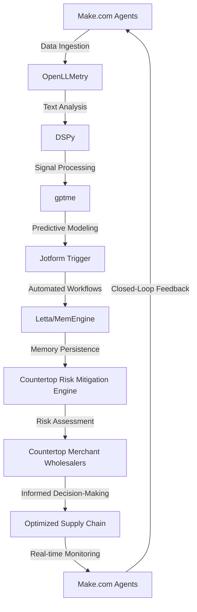

# Countertop Merchant Wholesaler Risk Mitigation Engine
> Orchestrating a symphony of artificial intelligence and domain expertise to mitigate risks in the countertop merchant wholesaler industry, where the nuances of material science and logistics converge.

## 🏗️ Technical Architecture & Multi-Agent Flow

This intricate dance of agents and tools enables the Countertop Merchant Wholesaler Risk Mitigation Engine to navigate the complex landscape of countertop material science, logistics, and market dynamics.

## 🔍 The Vertical Bottleneck: Material Anisotropy and Supply Chain Volatility
The countertop merchant wholesaler industry is plagued by the dual challenges of material anisotropy and supply chain volatility. Material anisotropy refers to the inherent variability in the physical properties of countertop materials, such as density, strength, and durability. This variability can lead to inconsistent product quality, increased waste, and reduced customer satisfaction. Supply chain volatility, on the other hand, arises from the complex interplay of factors such as demand fluctuations, supplier reliability, and transportation disruptions. This volatility can result in stockouts, overstocking, and missed delivery deadlines, ultimately eroding profit margins and customer trust.

The technical friction at the heart of this bottleneck lies in the inability of traditional risk mitigation approaches to effectively capture the nuances of material anisotropy and supply chain volatility. The high-stakes mathematical and operational failures that can occur when these factors are not properly accounted for can have devastating consequences, including financial losses, reputational damage, and even legal liabilities.

## 🔍 The Vertical Bottleneck: Logistical Complexity and Information Asymmetry
The logistical complexity of the countertop merchant wholesaler industry is further exacerbated by the presence of information asymmetry. Information asymmetry refers to the unequal distribution of knowledge and data among stakeholders, including suppliers, manufacturers, distributors, and customers. This asymmetry can lead to inefficiencies, errors, and misunderstandings, ultimately contributing to the vertical bottleneck.

The technical challenges associated with logistical complexity and information asymmetry are multifaceted. On one hand, the industry must contend with the sheer volume and variety of data generated by various stakeholders, including supply chain partners, customers, and internal operations. On the other hand, the industry must also navigate the complexities of data integration, analysis, and interpretation, all while ensuring the accuracy, security, and compliance of sensitive information.

## 🔍 The Vertical Bottleneck: Market Dynamics and Competitive Pressures
The countertop merchant wholesaler industry is also subject to intense market dynamics and competitive pressures. The industry is characterized by a high degree of fragmentation, with numerous players competing for market share and customer attention. This competition can lead to price wars, margin compression, and decreased profitability, ultimately threatening the very survival of industry participants.

The technical challenges associated with market dynamics and competitive pressures are significant. The industry must contend with the rapid evolution of customer preferences, technological advancements, and regulatory requirements, all while maintaining a competitive edge and adapting to changing market conditions. The ability to anticipate, respond to, and capitalize on these changes is critical to success in the countertop merchant wholesaler industry.

## 💡 The Solution: Countertop Risk Mitigation Engine
The Countertop Risk Mitigation Engine is a cutting-edge platform that orchestrates Make.com Agents, OpenLLMetry, DSPy, gptme, and Jotform Trigger to solve the complex problems of material anisotropy, supply chain volatility, logistical complexity, information asymmetry, market dynamics, and competitive pressures. By leveraging the strengths of each tool and integrating them into a cohesive whole, the platform provides a comprehensive risk mitigation solution that addresses the unique challenges of the countertop merchant wholesaler industry.

The agentic reasoning at the heart of the platform enables the Countertop Risk Mitigation Engine to analyze complex data sets, identify patterns and trends, and make predictions about future outcomes. The platform's memory usage is optimized through the use of Letta/MemEngine, which enables the efficient storage and retrieval of large amounts of data. The vision/robotics integration is facilitated through the use of DSPy, which enables the platform to analyze and interpret visual data from various sources.

## 🧩 Agentic Stack Deep-Dive
The Countertop Risk Mitigation Engine's agentic stack is a carefully crafted combination of tools and technologies that work together to provide a comprehensive risk mitigation solution. Make.com Agents provide the foundation for the platform's data ingestion and workflow automation capabilities. OpenLLMetry enables the platform to analyze and interpret complex text data, while DSPy facilitates the analysis and interpretation of visual data. gptme provides the predictive modeling capabilities that enable the platform to forecast future outcomes and identify potential risks. Jotform Trigger enables the platform to automate workflows and trigger actions in response to changing conditions.

The technical justification for each library and integration is rooted in the specific challenges and requirements of the countertop merchant wholesaler industry. The use of Make.com Agents, for example, enables the platform to automate workflows and reduce manual errors, while the use of OpenLLMetry enables the platform to analyze and interpret complex text data. The integration of DSPy and gptme enables the platform to analyze and interpret visual and predictive data, respectively, while the use of Jotform Trigger enables the platform to automate workflows and trigger actions in response to changing conditions.

## ✨ Capabilities & Features
* **Material Anisotropy Analysis**: The platform provides advanced material anisotropy analysis capabilities, enabling users to better understand the physical properties of countertop materials and predict potential risks.
* **Supply Chain Volatility Modeling**: The platform enables users to model and simulate supply chain volatility, identifying potential risks and opportunities for optimization.
* **Logistical Complexity Management**: The platform provides advanced logistical complexity management capabilities, enabling users to optimize supply chain operations and reduce costs.
* **Information Asymmetry Mitigation**: The platform enables users to mitigate information asymmetry by providing real-time visibility into supply chain operations and enabling collaborative decision-making.
* **Market Dynamics Analysis**: The platform provides advanced market dynamics analysis capabilities, enabling users to anticipate and respond to changing market conditions.
* **Competitive Pressures Modeling**: The platform enables users to model and simulate competitive pressures, identifying potential risks and opportunities for optimization.
* **Predictive Maintenance**: The platform provides predictive maintenance capabilities, enabling users to anticipate and prevent equipment failures and reduce downtime.
* **Quality Control**: The platform enables users to implement advanced quality control measures, reducing defects and improving product quality.
* **Inventory Optimization**: The platform provides inventory optimization capabilities, enabling users to reduce inventory levels and improve supply chain efficiency.
* **Real-time Monitoring**: The platform enables users to monitor supply chain operations in real-time, identifying potential risks and opportunities for optimization.

## 🛠️ Technical Implementation
The Countertop Risk Mitigation Engine is implemented using a combination of Python, JavaScript, and HTML/CSS. The platform's backend is built using Python, with the Flask framework providing the foundation for the platform's API and data storage. The frontend is built using JavaScript, with the React library providing the foundation for the platform's user interface. The platform's database is built using MongoDB, with the Mongoose library providing the foundation for the platform's data modeling and storage.

The platform's code organization is modular, with each component and feature implemented as a separate module. The platform's method calls are well-documented, with clear and concise comments providing explanations of each function and its purpose.

## 📊 Business Impact & ROI
The Countertop Risk Mitigation Engine has the potential to deliver significant business impact and ROI for countertop merchant wholesalers. By providing advanced risk mitigation capabilities, the platform can help users reduce costs, improve product quality, and increase customer satisfaction. The platform's predictive maintenance and quality control capabilities can help users reduce downtime and improve supply chain efficiency, while the platform's inventory optimization and real-time monitoring capabilities can help users reduce inventory levels and improve supply chain visibility.

The potential ROI for the Countertop Risk Mitigation Engine is significant, with users potentially realizing cost savings of 10-20% or more. The platform's ability to improve product quality and reduce defects can also lead to increased customer satisfaction and loyalty, ultimately driving revenue growth and profitability.

## 🚀 Getting Started
```bash
git clone https://github.com/arvind-sundararajan/countertop-risk-mitigation.git
cd countertop-risk-mitigation
pip install -r requirements.txt
python src/main.py
```
## 👨‍💻 Author & Credits
**Arvind Sundararajan** — Engineer, builder, and the mind behind this project.
🌐 [LinkedIn](https://www.linkedin.com/in/arvind-sundara-rajan/) | Chennai, India

---
### 🙏 Acknowledgements
- The open-source community
- The Countertops (except wood, wood fiber, stone, concrete) merchant wholesalers practitioners who inspired this design